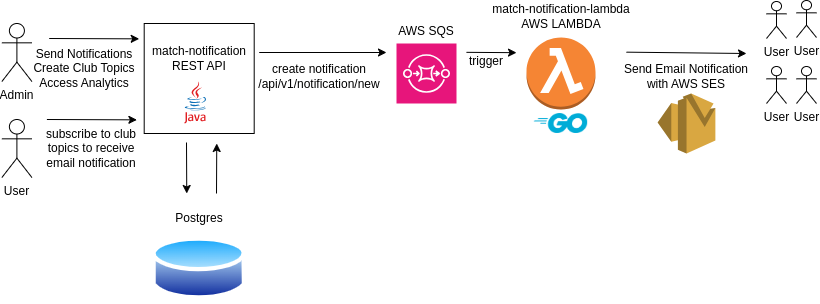

# Match Notification Lambda
<table>
<tr>
<td>
    Send email notification to users that are subscribed to a soccer club topic. Users can receive news, daily-matches and goal notifications.
</td>
</tr>
</table>


## API Repository
API Repository: https://match-notification-service.onrender.com/

## Backend Overview



## Usage
- Run `make build` and then `make zip` to create a function.zip file
- Upload the function.zip on AWS Lambda function
- Required env variables
```
FROM_EMAIL_ADDRESS=
MATCH_NOTIFICATION_API=
```

## License

MIT

